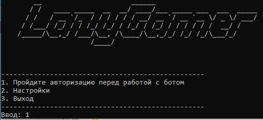
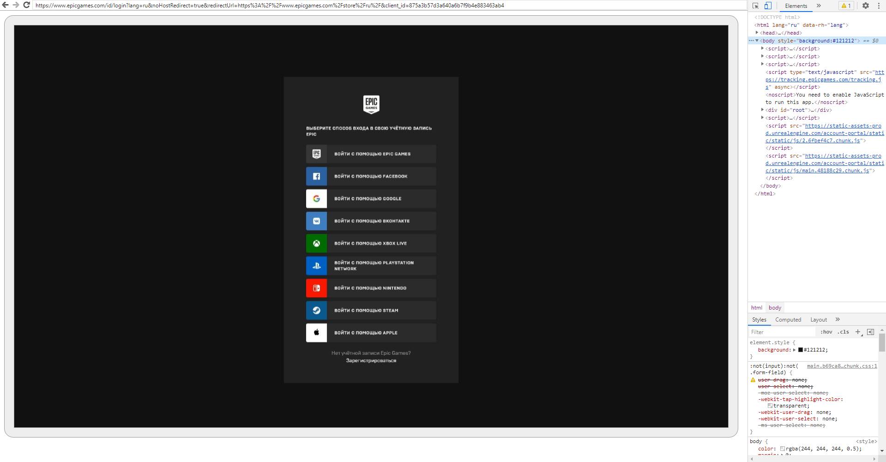
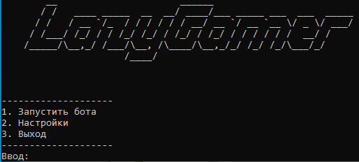

# Lazy-gamer
Бот для сбора бесплатных игр из Epic Games

### Требования для запуска
1. Python 3.8
2. Браузер Chrome или Ms Edge

### Прохождение авторизации и запуск бота
1. Выбираем первый пункт в меню "Пройти авторизацию" (*При первом запуске откроется окно брандмауэра, дайте разрешение*)

2. После запуска через пару секунд откроется окно браузера с окном авторизации

3. После завершения авторизации можно запускать бота

### Аргумент запуска
`--silent`  запускает бота в фоне

### Обратная связь
В случае возникновения ошибок или вопросов обращайтесь:

TG: `@LazyDeus`
